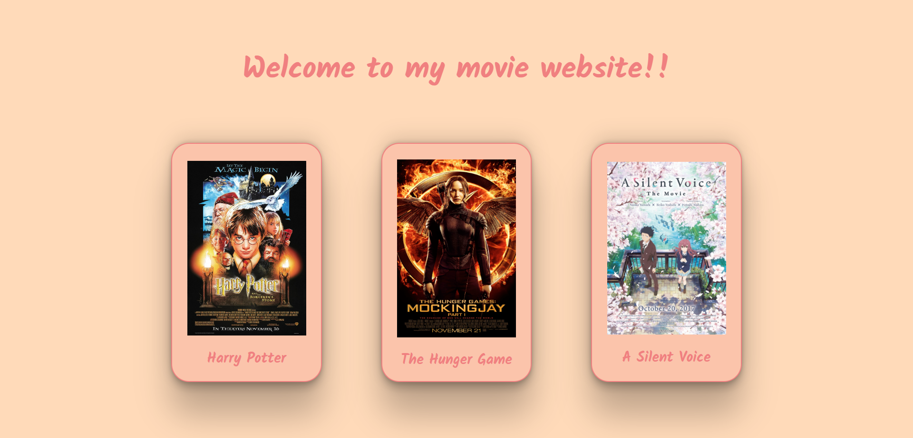

<p dir="rtl">
<h3><a href="https://github.com/kuwaitcodes/UC-web-cw-7">تمرين </a></h3></p>


<p dir="rtl">
 
### اليوم راح نسوي موقع نعرض فيه أفلامنا ! 🎥 

<div align="center">

</div>

<p dir="rtl">
 <strong><a href="https://docs.google.com/document/d/1-yaUk4FLViYxKpyzCAoV314MNGzfRxGr1QFT5bY5wHc/edit#">الخطوات</a></strong></p>

1. قم بعمل Fork
2. افتح الـrepo في github desktop
3. من برنامج github desktop اضغط على open in visual studio code
4. افتح ملف script.js وابدأ الحل
5. أنشئ **كائن** جديد وقم بتسميته **movie1** وأعطه الخصائص التالية: `name,img` وقم بتعبئتها حسب ماتريد `ملاحظة: في img سنقوم بوضع رابط لأي صورة خاصة بالفلم`
6. كرر الخطوة السابقة مرتين ولا تنسى تغيير أسماء الكائنات إلى **movie2** و **movie3** لتحصل على 3 أفلام مختلفة
7. أنشئ **مصفوفة** جديدة وقم بتسميتها **movies** واجعلها فارغة `[]`
8. أضف الثلاث كائنات التي قمت بإنشائها إلى مصفوفة movies `استخدم ()push.`
9. قم بإنشاء *متغير* باسم movieContainer واجعل قميته = عنصر الـhtml الذي يحتوي على "id="container
   <br>`ملاحظة مهمة: يجب أن تستخدم ('...')document.getElementById`
10. قم باستخدام دالة المصفوفة ()forEach. على **المصفوفة** movies بحيث تعرض جميع الأفلام في موقعك، استخدم الكود التالي داخل الدالة، **مع تغيير ما يلزم**
</p>
<p dir="ltr">
 
  ```js
  movieContainer.innerHTML += `
   <div class="movie">
   
   <h2>${...}</h2>
   </div>
  `;
  ```

</p>

11.  احفظ التغييرات وقم بعمل commit و push
12. قم بتسليم التمرين على موقع <a href="https://lab.joincoded.com/dashboard/tasks">Coded Lab</a>

### لقد قمت بإنهاء أخر كلاس وورك في هذا الفصل، مبروك يا مبرمج! 👏🏼🤍


<p dir="rtl">
<strong>بونص✨! </strong></p>

- ستقوم بإنشاء قسم خاص لـ"فلم اليوم" في نفس صفحة الموقع، في كل مره يدخل فيها المستخدم الموقع، سيتغير هذا الفلم بشكل عشوائي ويتم اختيار فلم من الأفلام الثلاثة `مساعدة: ستقوم باستخدام دوال مكتبة Math`
  
 <p dir="rtl">
"لا تترددون أنكم تسألون المدرسين 👌"
</p>
